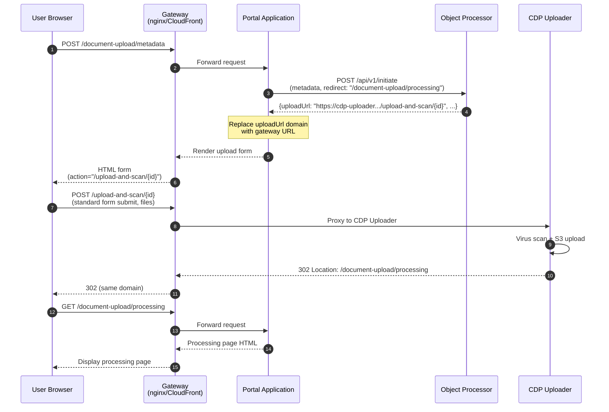
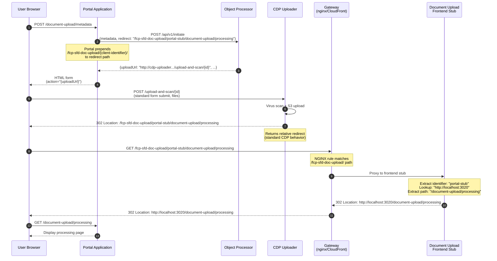
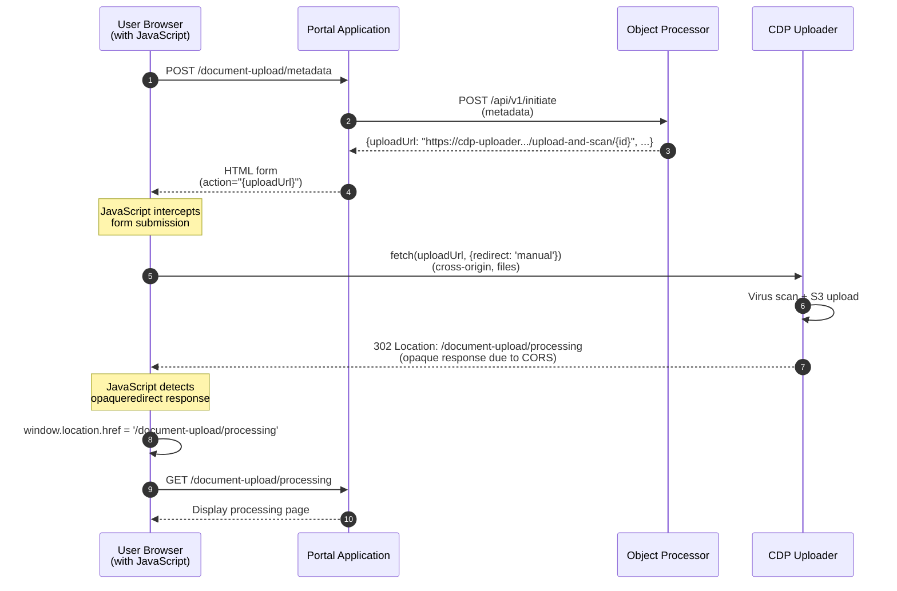

# FCP Rural Payments Portal Stub

A reference implementation demonstrating how client portals (such as the Rural Payments portal) can integrate with the **Single Front Door (SFD) Document Upload Service**.

This stub showcases the complete integration pattern including authentication, metadata submission, browser-based file uploads, and status tracking through the SFD infrastructure.

> **IMPORTANT**: This particular pattern is still a work in progress that is in the process of being verified.  Once confirmed, this warning will be removed.
>
> For latest progress contact John Watson (john.watson1@defra.gov.uk).

## Purpose

This stub portal serves as a **working example** for external teams integrating their portals with the SFD Document Upload Service. It demonstrates:

- How to authenticate with the Object Processor using AWS Cognito (via CDP API Gateway)
- How to initiate upload sessions with business metadata
- How to integrate with the CDP Uploader for secure, browser-based file uploads
- How to poll for upload status and display results to users

## Architecture Overview

The SFD Document Upload Service consists of three main components working together. The architecture differs based on the upload mode you choose (see Upload Modes section below for details).

### Component Roles

**Portal Stub (this repository)**  
- Client-facing GOV.UK frontend application
- Collects business metadata (CRN, SBI, FRN, document type, reference)
- Obtains OAuth2 tokens from AWS Cognito (when authentication enabled)
- Calls Object Processor APIs to initiate uploads and check status
- Handles browser-based file uploads using one of three patterns (see Upload Modes below)

**Object Processor** ([DEFRA/fcp-sfd-object-processor](https://github.com/DEFRA/fcp-sfd-object-processor))
- **The face of the SFD Document Upload Service**
- Acts as an intermediary between clients and CDP Uploader
- Validates JWT tokens from Cognito via Microsoft Entra ID (when authentication enabled)
- Provides `/api/v1/initiate` endpoint to create upload sessions
- Provides `/api/v1/status/{correlationId}` endpoint to query upload status
- Receives callbacks from CDP Uploader when files are scanned
- Persists metadata to MongoDB and publishes events to AWS SNS

**CDP Uploader** ([DEFRA/cdp-uploader](https://github.com/DEFRA/cdp-uploader))
- Handles browser-based file uploads via multipart form submissions
- Performs virus scanning using ClamAV
- Uploads clean files to AWS S3
- Sends scan results back to Object Processor via callback endpoint
- Responds to browser with 302 redirect on successful upload acceptance

**Document Upload Frontend Stub** ([document-upload-frontend-stub/](document-upload-frontend-stub/))
- Maps relative redirects from CDP Uploader to client-specific absolute URLs
- Supports multi-client integration patterns
- Only used in frontend-redirect mode
- See [document-upload-frontend-stub/README.md](document-upload-frontend-stub/README.md) for details

## Dependencies

### Local Development (Default)

For local development, this repository includes a **Document Upload Stub** ([document-upload-stub/](document-upload-stub/)) that replaces both the Object Processor and CDP Uploader services. This stub is **used by default** when running `docker compose up`, allowing you to run the portal end-to-end without any external dependencies.

The stub provides all necessary endpoints:
- `POST /api/v1/initiate` - Initiates upload sessions
- `GET /api/v1/status/{correlationId}` - Returns upload status
- `POST /upload-and-scan/{uploadId}` - Accepts file uploads

**What the stub does:**
- Accepts all uploads and marks them as SUCCESSFUL after 2 seconds
- Uses in-memory storage (no database required)
- Runs on port 3021 (accessible at `http://localhost:3021`)
- No authentication required
- Perfect for local testing and development

**Content Security Policy Configuration:**

The portal uses Content Security Policy (CSP) to restrict which domains the browser can connect to for file uploads. For the local stub to work, you need to allow `http://localhost:3021` in the CSP configuration.

This is configured via the `ADDITIONAL_UPLOAD_DOMAINS` environment variable, which accepts a comma-separated list of domains:

```bash
# Allow browser to upload files to local stub
ADDITIONAL_UPLOAD_DOMAINS=http://localhost:3021

# Multiple domains (if needed)
ADDITIONAL_UPLOAD_DOMAINS=http://localhost:3021,http://another-domain:8080
```

This is **already configured by default** in [compose.yml](compose.yml), so the stub works out of the box when running `docker compose up`.

See [document-upload-stub/README.md](document-upload-stub/README.md) for more details.

### Using Real Services (Optional)

To connect to a **real Object Processor instance** instead of the stub, override the environment variable:

```bash
OBJECT_PROCESSOR_HOST=http://your-object-processor-host:3004
```

When using a real Object Processor:
- The Object Processor will provide upload URLs pointing to the real CDP Uploader
- You'll need AWS Cognito configured (`COGNITO_ENABLED=true`) if the Object Processor has authentication enabled
- Files will be uploaded to real S3 storage
- Virus scanning will be performed by the real CDP Uploader service

This works automatically when both services run in the same Docker network (e.g., via `docker compose` in the parent `fcp-sfd-core` repository).

## Authentication with Cognito

The portal authenticates with the Object Processor using **AWS Cognito** via the **CDP API Gateway**.

### Cognito Configuration

Required environment variables (see [.env.example](.env.example)):

```bash
# Enable/disable Cognito authentication
COGNITO_ENABLED=true

# Cognito OAuth2 settings (required when COGNITO_ENABLED=true)
COGNITO_DOMAIN=your-app.auth.eu-west-2.amazoncognito.com
COGNITO_CLIENT_ID=your-client-id-here
COGNITO_CLIENT_SECRET=your-client-secret-here
```

### Disabling Cognito for Local Development

By default, Cognito is **disabled** for easier local development.

## Environment Variables

Copy [.env.example](.env.example) to `.env` and configure as needed:

```bash
# Copy the example file
cp .env.example .env

# Edit with your values
vi .env
```

**Example configuration** (from `.env.example`):

```bash
# Enable Cognito authentication (default: false for local dev)
COGNITO_ENABLED=true

# AWS Cognito OAuth2 settings
COGNITO_DOMAIN=your-service-c63f2.auth.eu-west-2.amazoncognito.com
COGNITO_CLIENT_ID=your-app-client-id-here
COGNITO_CLIENT_SECRET=your-app-client-secret-here

# Object Processor location (default: docker network service name)
# Override this if running Object Processor elsewhere
OBJECT_PROCESSOR_HOST=http://fcp-sfd-object-processor:3004

# Additional upload domains for CSP (for local development stub)
ADDITIONAL_UPLOAD_DOMAINS=http://localhost:3021
```

## Upload Modes

This stub supports **three upload patterns** to demonstrate different integration approaches with CDP Uploader.

The key difference is **where the browser sends file uploads and how redirects are handled**:

| Mode | Progressive Enhancement | JavaScript Required | Use Case |
|------|------------------------|---------------------|----------|
| **gateway-routing** (recommended) | ✅ Yes | ❌ No | CDP services, services with gateway infrastructure |
| **frontend-redirect** | ✅ Yes | ❌ No | Multi-client scenarios, external services needing absolute redirects |
| **direct** (fallback) | ❌ No | ✅ Yes | Only when gateway/document-upload-frontend not possible |

### Mode Comparison

| Feature | gateway-routing | frontend-redirect | direct |
|---------|----------------|-------------------|--------|
| **Browser upload target** | Gateway domain | CDP Uploader | CDP Uploader |
| **Redirect handling** | Gateway routes relatively | Gateway proxies to frontend stub, then redirects | JavaScript intercepts |
| **Works without JavaScript** | ✅ Yes | ✅ Yes | ❌ No |
| **GOV.UK Service Manual compliant** | ✅ Yes | ✅ Yes | ❌ No |
| **Infrastructure required** | Gateway (nginx, CloudFront) | Gateway + document upload frontend service | None |
| **CSP complexity** | Simple (self only) | Simple (self + CDP domains) | Complex (self + CDP domains) |  
| **Accessibility** | ✅ Full | ✅ Full | ⚠️ Reduced |
| **Multi-client support** | Per-client gateway config | ✅ Built-in | N/A |

---

###{#gateway-routing-mode} Gateway Routing Mode (Recommended for CDP Services)

**Best for:** CDP platform services, services with existing gateway infrastructure (nginx, CloudFront, API Gateway), any service requiring progressive enhancement.

**What is gateway routing?**

Gateway routing uses a reverse proxy (e.g., nginx, CloudFront, API Gateway) as a single entry point for all browser requests. The browser only ever communicates with the gateway's domain, and the gateway intelligently routes requests to different backend services based on the URL path.

This is how most production web applications are architected (e.g., CloudFront → multiple Lambda/ECS backends).

#### How It Works



#### Step-by-Step Flow

1. **Browser submits metadata** to gateway domain (e.g., `https://your-portal.gov.uk/metadata`)
2. **Gateway routes** request to Portal application
3. **Portal calls Object Processor** `/api/v1/initiate` with relative redirect path
4. **Portal overrides uploadUrl** to use gateway domain: `/upload-and-scan/{uploadId}`
5. **Browser receives upload form** with action pointing to gateway path
6. **User submits files** via standard HTML form POST (no JavaScript)
7. **Gateway proxies** upload to CDP Uploader
8. **CDP Uploader scans files** and stores in S3
9. **CDP Uploader returns** `302 Location: /document-upload/processing` (relative)
10. **Browser follows redirect** within gateway domain
11. **Gateway routes** to Portal's processing page
12. **Portal polls status** and displays result

**Key insight:** The gateway makes multiple backend services appear as one unified application to the browser. Everything is same-origin.

#### Configuration

```bash
UPLOAD_MODE=gateway-routing  # Default
GATEWAY_URL=http://localhost:3019
REDIRECT_AFTER_UPLOAD=/document-upload/processing
```

**Visit:** `http://localhost:3019` (nginx gateway)

#### Benefits

- ✅ **Progressive enhancement** - Works without JavaScript
- ✅ **GOV.UK Service Manual compliant**
- ✅ **Simple CSP** - Only `'self'` needed (no cross-origin)
- ✅ **Accessible** - Works for all users
- ✅ **Standard architecture** - How production web apps work
- ✅ **Clean URLs** - Single domain for entire user journey

#### Requirements

- Gateway infrastructure (nginx, CloudFront, API Gateway, etc.)
- Gateway configuration to route `/upload-and-scan/*` to CDP Uploader

#### Files

- [nginx/nginx.conf](nginx/nginx.conf) - Example gateway routing rules
- [compose.yml](compose.yml) - nginx service on port 3019
- [src/routes/document-upload.js](src/routes/document-upload.js) - uploadUrl override logic

---

### Frontend Redirect Mode (Recommended for Multi-Client Scenarios)

**Best for:** External services on different domains (e.g., Rural Payments Portal in Crown Hosting), scenarios where multiple clients need centralized redirect mapping, services that cannot configure gateway-level routing.

**What is frontend redirect mode?**

Frontend redirect mode solves the challenge where:
1. Multiple client portals exist on different domains (e.g., `client1.gov.uk`, `client2.org.uk`)
2. CDP Uploader returns relative redirects
3. Each client needs redirects transformed to their absolute domain
4. A central "redirect mapper" service owned by the document upload team handles the transformation

This pattern is valuable when:
- Clients don't control gateway infrastructure (e.g., external portals in Crown Hosting)
- Multiple clients need different redirect destinations
- You want centralized redirect mapping logic for consistency

#### How It Works



#### Step-by-Step Flow

1. **Browser submits metadata** to portal
2. **Portal prepends redirect mapper prefix** to redirect: `/fcp-sfd-doc-upload/{client-identifier}/document-upload/processing`
3. **Portal calls Object Processor** `/api/v1/initiate` with prefixed redirect
4. **Browser receives upload form** with action pointing to CDP Uploader
5. **User submits files** via standard HTML form POST (no JavaScript)
6. **CDP Uploader scans files** and stores in S3
7. **CDP Uploader returns relative redirect**: `/fcp-sfd-doc-upload/portal-stub/document-upload/processing`
8. **Browser follows redirect to gateway** (relative URL resolves to gateway domain)
9. **Gateway NGINX rule matches** `/fcp-sfd-doc-upload/` and proxies to document-upload-frontend stub
10. **Frontend stub extracts identifier** and looks up client's absolute domain
11. **Frontend stub redirects (absolute)** to client domain: `http://localhost:3020/document-upload/processing`
12. **Browser arrives** at portal's processing page
13. **Portal polls status** and displays result

**Key insight:** NGINX gateway routing eliminates need for application-level redirect detection. The uploader just returns standard relative redirects, and NGINX proxies requests to the frontend stub based on path pattern.

#### Configuration

```bash
UPLOAD_MODE=frontend-redirect
REDIRECT_AFTER_UPLOAD=/document-upload/processing
ADDITIONAL_UPLOAD_DOMAINS=http://localhost:3021  # CSP allows uploader (stub)
```

**Visit:** `http://localhost:3020`

#### Benefits

- ✅ **Progressive enhancement** - Works without JavaScript
- ✅ **GOV.UK Service Manual compliant**
- ✅ **Multi-client support** - Centralized redirect mapping
- ✅ **No gateway required** - Client doesn't need to configure routing
- ✅ **Accessible** - Works for all users
- ✅ **Extensible** - Easy to add new clients to mapping

#### Requirements

- Gateway with NGINX routing rules (included in this repo at [nginx/nginx.conf](nginx/nginx.conf))
- Document upload frontend stub running (included in this repo at [document-upload-frontend-stub/](document-upload-frontend-stub/))
- Client identifier configured in frontend stub
- CSP allows form submissions to CDP Uploader

#### Files

- [nginx/nginx.conf](nginx/nginx.conf) - Gateway routing rules (proxies `/fcp-sfd-doc-upload/` to frontend stub)
- [document-upload-frontend-stub/](document-upload-frontend-stub/) - Redirect mapping service
- [document-upload-frontend-stub/src/routes/redirect.js](document-upload-frontend-stub/src/routes/redirect.js) - Client identifier to domain mapping
- [src/routes/document-upload.js](src/routes/document-upload.js#L73-L78) - Redirect prefix logic
- [src/plugins/content-security-policy.js](src/plugins/content-security-policy.js#L25-L34) - CSP configuration

---

### Direct Mode (Fallback Only)

**Best for:** Situations where neither gateway routing nor redirect mapper are feasible (rare). **Use only as a last resort.**

**⚠️ This mode requires JavaScript and does not support progressive enhancement.** It fails GOV.UK Service Manual accessibility requirements.

#### How It Works



#### Step-by-Step Flow

1. **Browser submits metadata** to portal
2. **Portal calls Object Processor** `/api/v1/initiate`
3. **Browser receives upload form** with action pointing directly to CDP Uploader domain
4. **User clicks submit** - JavaScript intercepts the event
5. **JavaScript uses fetch()** with `redirect: 'manual'` to POST files (cross-origin)
6. **CDP Uploader scans files** and stores in S3
7. **CDP Uploader returns** `302` redirect (browser sees `opaqueredirect` due to CORS)
8. **JavaScript detects** opaque redirect and manually navigates to `/document-upload/processing`
9. **Browser loads** portal's processing page
10. **Portal polls status** and displays result

**Key insight:** Without gateway or document-upload-frontend, JavaScript must manually handle cross-origin redirects, creating a dependency on client-side code.

#### Configuration

```bash
UPLOAD_MODE=direct
ADDITIONAL_UPLOAD_DOMAINS=http://localhost:3021  # CSP allows CDP Uploader
```

**Visit:** `http://localhost:3020`

#### Limitations

- ❌ **Requires JavaScript** - Users without JS cannot upload files
- ❌ **Not accessible** - Fails WCAG/GOV.UK accessibility requirements
- ❌ **Cross-origin complexity** - Requires careful CSP configuration
- ❌ **Progressive enhancement failure** - Does not comply with Service Manual

#### Benefits

- ✅ **Simpler infrastructure** - No gateway or document-upload-frontend needed
- ✅ **May be only option** in constrained environments

#### Files

- [src/client/javascript/document-upload.js](src/client/javascript/document-upload.js) - JavaScript fetch() interception

---

### Switching Between Modes

All three modes work with `docker compose up`:

```bash
# Gateway routing mode (DEFAULT - recommended for CDP services)
docker compose up
# Visit http://localhost:3019 (nginx gateway)

# Frontend redirect mode (recommended for multi-client external services)
UPLOAD_MODE=frontend-redirect docker compose up
# Visit http://localhost:3020

# Direct mode (fallback only - requires JavaScript, not accessible)
UPLOAD_MODE=direct docker compose up
# Visit http://localhost:3020
```

### Port Reference

- **3019** - nginx gateway (gateway-routing mode entry point)
- **3020** - Portal application (frontend-redirect and direct mode entry point)
- **3021** - Document upload stub (Object Processor + CDP Uploader APIs)
- **3022** - Redirect mapper (frontend-redirect mode only)

### Which Mode Should I Use?

**Decision Tree:**

1. **Are you building a CDP platform service?** → Use **gateway-routing** mode
   - You have infrastructure gateway capabilities
   - Standard pattern for CDP services
   
2. **Are you an external service on a different domain (e.g., Crown Hosting)?** → Use **frontend-redirect** mode
   - Especially if multiple clients will use this service
   - Cannot configure gateway at your infrastructure level
   - Need progressive enhancement compliance
   
3. **Can you absolutely not use gateway-routing or frontend-redirect?** → Use **direct** mode (last resort)
   - Accept trade-off: simpler infrastructure but fails accessibility
   - Not compliant with GOV.UK Service Manual

### Content Security Policy (CSP) by Mode

The stub automatically configures CSP based on `UPLOAD_MODE`:

| Directive | gateway-routing | frontend-redirect | direct |
|-----------|----------------|-------------------|--------|
| `connect-src` | `'self'` | `'self'` | `'self'`, CDP domains, `ADDITIONAL_UPLOAD_DOMAINS` |
| `form-action` | `'self'` | `'self'`, CDP domains, `ADDITIONAL_UPLOAD_DOMAINS` | `'self'`, CDP domains, `ADDITIONAL_UPLOAD_DOMAINS` |

See [src/plugins/content-security-policy.js](src/plugins/content-security-policy.js) for implementation.

---

## Browser-Based Upload Architecture

- Docker and Docker Compose

### Quick Start

**Gateway routing mode (DEFAULT)** - progressive enhancement, no JS required:
```bash
docker compose up
# Visit http://localhost:3019
```

**Frontend redirect mode** - for multi-client scenarios, progressive enhancement:
```bash
UPLOAD_MODE=frontend-redirect docker compose up
# Visit http://localhost:3020
```

**Direct mode (fallback)** - only if gateway not possible, requires JavaScript:
```bash
UPLOAD_MODE=direct docker compose up
# Visit http://localhost:3020
```

All commands start all required services (portal, stub, nginx, document-upload-frontend-stub). The mode only changes how uploads are routed and whether JavaScript is required.

**💡 Tip:** Always use gateway routing or frontend redirect mode for production services requiring progressive enhancement.

## User Journey

The portal implements a 6-step user journey following GOV.UK Design System patterns:

1. **Sign In** ([/document-upload/sign-in](http://localhost:3020/document-upload/sign-in))
   - User enters their 10-digit CRN (Customer Reference Number)
   - CRN stored in session cookie

2. **Enter Metadata** ([/document-upload/metadata](http://localhost:3020/document-upload/metadata))
   - **SBI** (Single Business Identifier) - 9 digits
   - **FRN** (Firm Reference Number) - 10 digits
   - **Reference** - User's own reference text
   - **Type** - Document type (e.g., CS_Agreement_Evidence)
   - **Service** - Source system (fcp-sfd-frontend or rps-portal)

3. **Upload Files** ([/document-upload/upload](http://localhost:3020/document-upload/upload))
   - Portal calls Object Processor `/api/v1/initiate` with metadata
   - Receives `correlationId`, `uploadId`, `uploadUrl`, and `statusUrl` from Object Processor
   - Browser submits files:
     - **Gateway routing mode**: Standard form POST to gateway's `/upload-and-scan/{uploadId}` (no JavaScript required)
     - **Direct mode**: JavaScript `fetch()` to CDP Uploader domain (requires JavaScript)
   - CDP Uploader responds with 302 redirect on acceptance

4. **Processing** ([/document-upload/processing](http://localhost:3020/document-upload/processing))
   - Auto-polls Object Processor using `statusUrl` every 3 seconds
   - Shows scanning progress (IN_PROGRESS → SUCCESSFUL/REJECTED)
   - CDP Uploader performs virus scan and uploads to S3 in background

5. **Success** ([/document-upload/success](http://localhost:3020/document-upload/success))
   - Displays confirmation with submission ID
   - Lists uploaded files and metadata

6. **Error** ([/document-upload/error](http://localhost:3020/document-upload/error))
   - Shown if files rejected (e.g., virus detected)
   - Displays rejection reason and affected files

## Testing

### Unit Tests

```bash
# Run all tests
npm run docker:test

# Run tests in watch mode (TDD)
npm run docker:test:watch

# Run linter
npm run lint

# Fix linting issues
npm run lint:fix
```

### Manual Testing in Browser

1. Start the portal and stub (see "Running Locally" above)
2. Navigate to the entry point:
   - **Gateway routing mode (default)**: [http://localhost:3019/document-upload/sign-in](http://localhost:3019/document-upload/sign-in)
   - **Direct mode**: [http://localhost:3020/document-upload/sign-in](http://localhost:3020/document-upload/sign-in)
3. Enter CRN: `1234567890`
4. Click "Continue"
5. Fill in metadata:
   - SBI: `123456789`
   - FRN: `1234567890`
   - Reference: `Test Upload`
   - Type: Select "CS Agreement Evidence"
   - Service: Select "FCP SFD Frontend"
6. Click "Continue"
7. Select a file to upload
8. Click "Upload documents"
9. Wait for processing (auto-refreshes every 3 seconds)
10. View success or error page

## Key Files

- [src/routes/document-upload.js](src/routes/document-upload.js) - 6 route handlers for upload journey
- [src/client/javascript/document-upload.js](src/client/javascript/document-upload.js) - Client-side upload handling (direct mode only)
- [src/common/helpers/cognito.js](src/common/helpers/cognito.js) - Cognito OAuth2 client with token caching
- [src/common/helpers/object-processor.js](src/common/helpers/object-processor.js) - Object Processor API client (`initiate`, `status`)
- [src/config/config.js](src/config/config.js) - Convict configuration schema
- [.env.example](.env.example) - Environment variable template
- [nginx/nginx.conf](nginx/nginx.conf) - Gateway routing configuration (gateway routing mode)

## Related Repositories

- **Object Processor**: [DEFRA/fcp-sfd-object-processor](https://github.com/DEFRA/fcp-sfd-object-processor) - SFD Document Upload API
- **CDP Uploader**: [DEFRA/cdp-uploader](https://github.com/DEFRA/cdp-uploader) - File upload and virus scanning service

## Licence

THIS INFORMATION IS LICENSED UNDER THE CONDITIONS OF THE OPEN GOVERNMENT LICENCE found at:

<http://www.nationalarchives.gov.uk/doc/open-government-licence/version/3>

The following attribution statement MUST be cited in your products and applications when using this information.

> Contains public sector information licensed under the Open Government license v3

### About the licence

The Open Government Licence (OGL) was developed by the Controller of Her Majesty's Stationery Office (HMSO) to enable
information providers in the public sector to license the use and re-use of their information under a common open
licence.

It is designed to encourage use and re-use of information freely and flexibly, with only a few conditions.
