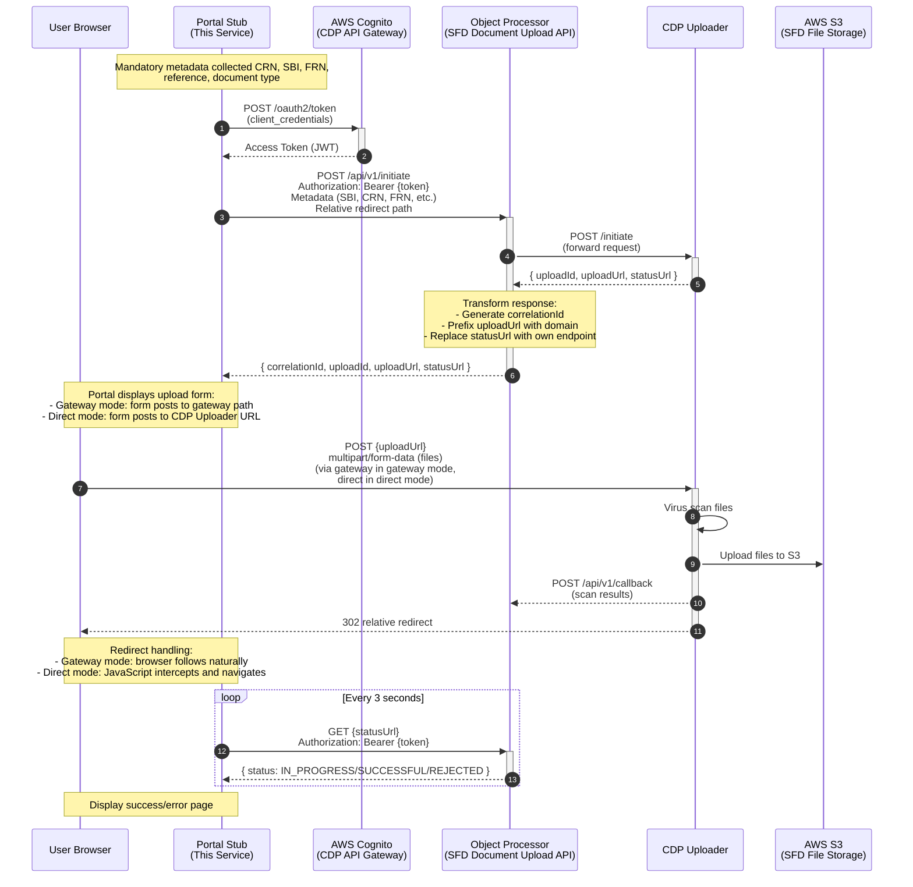
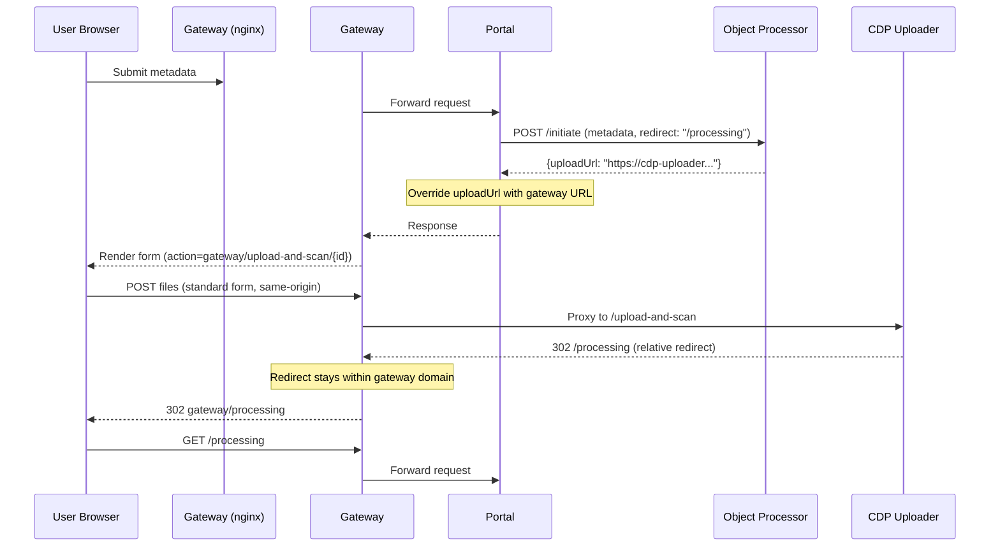
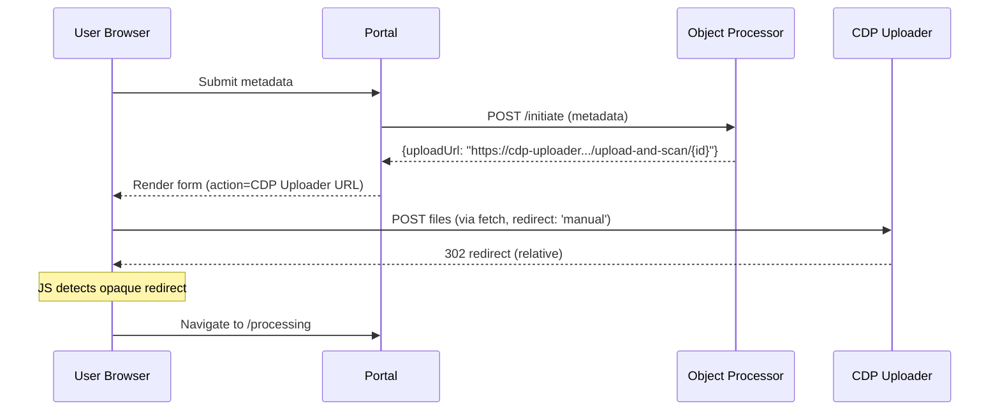

# FCP Rural Payments Portal Stub

A reference implementation demonstrating how client portals (such as the Rural Payments portal) can integrate with the **Single Front Door (SFD) Document Upload Service**.

This stub showcases the complete integration pattern including authentication, metadata submission, browser-based file uploads, and status tracking through the SFD infrastructure.

> **IMPORTANT**: This particular pattern is still a work in progress that is in the process of being verified.  Once confirmed, this warning will be removed.
>
> For latest progress contact John Watson (john.watson1@defra.gov.uk).

## Purpose

This stub portal serves as a **working example** for external teams integrating their portals with the SFD Document Upload Service. It demonstrates:

- How to authenticate with the Object Processor using AWS Cognito (via CDP API Gateway)
- How to initiate upload sessions with business metadata
- How to integrate with the CDP Uploader for secure, browser-based file uploads
- How to poll for upload status and display results to users

## Architecture Overview

The SFD Document Upload Service consists of three main components working together:



### Component Roles

**Portal Stub (this repository)**  
- Client-facing GOV.UK frontend application
- Collects business metadata (CRN, SBI, FRN, document type, reference)
- Obtains OAuth2 tokens from AWS Cognito
- Calls Object Processor APIs to initiate uploads and check status
- Handles browser-based file uploads:
  - **Gateway routing mode**: Browser posts to gateway, which proxies to CDP Uploader
  - **Direct mode**: Browser posts directly to CDP Uploader via JavaScript fetch

**Object Processor** ([DEFRA/fcp-sfd-object-processor](https://github.com/DEFRA/fcp-sfd-object-processor))
- **The face of the SFD Document Upload Service**
- Acts as an intermediary between clients and CDP Uploader
- Validates JWT tokens from Cognito via Microsoft Entra ID
- Provides `/api/v1/initiate` endpoint to create upload sessions
- Provides `/api/v1/status/{correlationId}` endpoint to query upload status
- Receives callbacks from CDP Uploader when files are scanned
- Persists metadata to MongoDB and publishes events to AWS SNS

**CDP Uploader** ([DEFRA/cdp-uploader](https://github.com/DEFRA/cdp-uploader))
- Handles browser-based file uploads via multipart form submissions
- Performs virus scanning using ClamAV
- Uploads clean files to AWS S3
- Sends scan results back to Object Processor via callback endpoint
- Responds to browser with 302 redirect on successful upload acceptance

## Dependencies

### Local Development (Default)

For local development, this repository includes a **Document Upload Stub** ([document-upload-stub/](document-upload-stub/)) that replaces both the Object Processor and CDP Uploader services. This stub is **used by default** when running `docker compose up`, allowing you to run the portal end-to-end without any external dependencies.

The stub provides all necessary endpoints:
- `POST /api/v1/initiate` - Initiates upload sessions
- `GET /api/v1/status/{correlationId}` - Returns upload status
- `POST /upload-and-scan/{uploadId}` - Accepts file uploads

**What the stub does:**
- Accepts all uploads and marks them as SUCCESSFUL after 2 seconds
- Uses in-memory storage (no database required)
- Runs on port 3021 (accessible at `http://localhost:3021`)
- No authentication required
- Perfect for local testing and development

**Content Security Policy Configuration:**

The portal uses Content Security Policy (CSP) to restrict which domains the browser can connect to for file uploads. For the local stub to work, you need to allow `http://localhost:3021` in the CSP configuration.

This is configured via the `ADDITIONAL_UPLOAD_DOMAINS` environment variable, which accepts a comma-separated list of domains:

```bash
# Allow browser to upload files to local stub
ADDITIONAL_UPLOAD_DOMAINS=http://localhost:3021

# Multiple domains (if needed)
ADDITIONAL_UPLOAD_DOMAINS=http://localhost:3021,http://another-domain:8080
```

This is **already configured by default** in [compose.yml](compose.yml), so the stub works out of the box when running `docker compose up`.

See [document-upload-stub/README.md](document-upload-stub/README.md) for more details.

### Using Real Services (Optional)

To connect to a **real Object Processor instance** instead of the stub, override the environment variable:

```bash
OBJECT_PROCESSOR_HOST=http://your-object-processor-host:3004
```

When using a real Object Processor:
- The Object Processor will provide upload URLs pointing to the real CDP Uploader
- You'll need AWS Cognito configured (`COGNITO_ENABLED=true`) if the Object Processor has authentication enabled
- Files will be uploaded to real S3 storage
- Virus scanning will be performed by the real CDP Uploader service

This works automatically when both services run in the same Docker network (e.g., via `docker compose` in the parent `fcp-sfd-core` repository).

## Authentication with Cognito

The portal authenticates with the Object Processor using **AWS Cognito** via the **CDP API Gateway**.

### Cognito Configuration

Required environment variables (see [.env.example](.env.example)):

```bash
# Enable/disable Cognito authentication
COGNITO_ENABLED=true

# Cognito OAuth2 settings (required when COGNITO_ENABLED=true)
COGNITO_DOMAIN=your-app.auth.eu-west-2.amazoncognito.com
COGNITO_CLIENT_ID=your-client-id-here
COGNITO_CLIENT_SECRET=your-client-secret-here
```

### Disabling Cognito for Local Development

By default, Cognito is **disabled** for easier local development.

## Environment Variables

Copy [.env.example](.env.example) to `.env` and configure as needed:

```bash
# Copy the example file
cp .env.example .env

# Edit with your values
vi .env
```

**Example configuration** (from `.env.example`):

```bash
# Enable Cognito authentication (default: false for local dev)
COGNITO_ENABLED=true

# AWS Cognito OAuth2 settings
COGNITO_DOMAIN=your-service-c63f2.auth.eu-west-2.amazoncognito.com
COGNITO_CLIENT_ID=your-app-client-id-here
COGNITO_CLIENT_SECRET=your-app-client-secret-here

# Object Processor location (default: docker network service name)
# Override this if running Object Processor elsewhere
OBJECT_PROCESSOR_HOST=http://fcp-sfd-object-processor:3004

# Additional upload domains for CSP (for local development stub)
ADDITIONAL_UPLOAD_DOMAINS=http://localhost:3021
```

## Upload Modes

This stub supports **two upload patterns** to demonstrate different integration approaches with CDP Uploader.

The key difference is **where the browser sends file uploads**:

- **Gateway routing mode (recommended)**: Browser posts files to `your-portal.gov.uk/upload-and-scan` (same domain as portal). A reverse proxy (gateway) routes this path to CDP Uploader behind the scenes. The browser never knows CDP Uploader exists - standard HTML forms work without JavaScript.

- **Direct mode (fallback)**: Browser posts files directly to CDP Uploader's domain (e.g., `cdp-uploader.cdp-int.defra.cloud`). This requires JavaScript to handle the cross-origin request and redirect. Only use if gateway routing is not possible.

**Gateway routing mode is the recommended approach** as it supports progressive enhancement (works without JavaScript), aligning with GOV.UK Service Manual requirements.

### Gateway Routing Mode (Recommended)

**Best for:** All services, especially external services (e.g., Rural Payments Portal) and those requiring progressive enhancement compliance.

**What is gateway routing?**

Gateway routing uses a reverse proxy (e.g., nginx, CloudFront, API Gateway) as a single entry point for all browser requests. The browser only ever communicates with the gateway's domain, and the gateway intelligently routes requests to different backend services based on the URL path.

In this pattern:
- Browser sends all requests to `your-portal.gov.uk`
- Gateway routes `/upload-and-scan/*` requests to CDP Uploader
- Gateway routes all other requests to the portal application
- From the browser's perspective, everything is same-origin
- Standard HTML form submissions work without JavaScript

This is how most production web applications are architected (e.g., CloudFront → multiple Lambda/ECS backends).



**Configuration:**
```bash
UPLOAD_MODE=gateway-routing # Default
GATEWAY_URL=http://localhost:3019
REDIRECT_AFTER_UPLOAD=/document-upload/processing
```

**Visit:** `http://localhost:3019` (nginx gateway, not direct portal)

**How it works:**
1. **Browser only knows about the gateway** - All URLs point to gateway domain (e.g., `https://your-portal.gov.uk`)
2. **Gateway routes by path** - Examines URL path and forwards to appropriate backend:
   - `/upload-and-scan/*` → CDP Uploader
   - Everything else → Portal application
3. **Portal sets relative redirect** - Tells Object Processor where to redirect after upload (e.g., `/document-upload/processing`)
4. **Form action points to gateway path** - Portal renders `<form action="/upload-and-scan/{uploadId}">`
5. **Browser posts to gateway** - Standard HTML form submission (no JavaScript needed)
6. **Gateway proxies to CDP Uploader** - Forwards the multipart file upload
7. **CDP Uploader redirects relatively** - Returns `302 Location: /document-upload/processing`
8. **Gateway preserves the redirect** - Browser follows redirect, gateway routes back to portal
9. **User sees processing page** - All within same domain, no CORS, no JavaScript required

**Key insight:** The gateway makes multiple backend services appear as one unified application to the browser.

**Benefits:**
- ✅ **Supports progressive enhancement** (works without JavaScript)
- ✅ **GOV.UK Service Manual compliant**
- ✅ No cross-origin requests (simpler CSP)
- ✅ Realistic for external services using CloudFront/nginx
- ✅ Better user accessibility

**Requirements:**
- ❌ Requires infrastructure gateway layer (nginx, CloudFront, etc.)

**Files:** 
- [nginx/nginx.conf](nginx/nginx.conf) - Gateway routing rules
- [compose.yml](compose.yml) - nginx service runs on port 3019

### Direct Mode (Fallback)

**Best for:** Services where gateway routing is not technically feasible (accepts reduced accessibility).

**⚠️ This mode requires JavaScript and does not support progressive enhancement.** Use this only when infrastructure constraints prevent implementing gateway routing.

In direct mode, the browser posts files directly to the CDP Uploader domain using JavaScript `fetch()`:



**Configuration:**
```bash
UPLOAD_MODE=direct  # Only use when gateway routing not possible
```

**Visit:** `http://localhost:3020`

**How it works:**
1. Form `action` points directly to CDP Uploader domain (cross-origin)
2. JavaScript intercepts form submission and uses `fetch()` with `redirect: 'manual'`
3. CDP Uploader returns relative `302` redirect
4. JavaScript detects `opaqueredirect` response and navigates to processing page

**Limitations:**
- ❌ **Requires JavaScript** (fails progressive enhancement)
- ❌ **Not accessible** to users without JavaScript
- ❌ Cross-origin requests require CSP configuration
- ❌ Does not comply with GOV.UK Service Manual progressive enhancement guidance

**Benefits:**
- ✅ Simpler infrastructure (no gateway/proxy needed)
- ✅ May be only option for some clients

**Files:** [src/client/javascript/document-upload.js](src/client/javascript/document-upload.js) handles fetch interception

### Switching Between Modes

Both modes work with the same `docker compose up` command:

```bash
# Gateway routing mode (DEFAULT - recommended, progressive enhancement)
docker compose up
# Visit http://localhost:3019 (nginx gateway)

# Direct mode (only if gateway routing not possible, requires client side JavaScript)
UPLOAD_MODE=direct docker compose up
# Visit http://localhost:3020
```

**Gateway routing mode is now the default** when running `docker compose up` without environment variables.

### Port Reference

- **3019** - nginx gateway (entry point for gateway-routing mode)
- **3020** - Portal application (entry point for direct mode)
- **3021** - Document upload stub (backend APIs)

### Which Mode Should I Use?

**Use Gateway Routing Mode (Recommended) if:**
- You need to comply with GOV.UK Service Manual progressive enhancement requirements ✅
- Your service must be accessible to users without JavaScript ✅
- You have infrastructure gateway capability (CloudFront, nginx, API Gateway, Azure Front Door, etc.)
  - Most production environments have this - it's standard web architecture
  - External portals (e.g., Rural Payments) typically use CloudFront or similar
- Your service is external to CDP (e.g., Rural Payments Portal)
- **This should be your default choice - it's how production web apps are built**

**Use Direct Mode (Fallback) only if:**
- Infrastructure constraints prevent gateway-level routing (rare on CDP platform)
- You're building a CDP platform service with no control over gateway configuration
- You accept the trade-off: simpler infrastructure but **fails progressive enhancement** ⚠️
- Your users are guaranteed to have JavaScript enabled (not GDS compliant)

### Content Security Policy (CSP) Differences

The stub automatically configures CSP based on `UPLOAD_MODE`:

**Direct mode:**
- `connect-src`: `'self'`, CDP domains, `ADDITIONAL_UPLOAD_DOMAINS`
- `form-action`: `'self'`, CDP domains, `ADDITIONAL_UPLOAD_DOMAINS`

**Gateway routing mode:**
- `connect-src`: `'self'` only
- `form-action`: `'self'` only

See [src/plugins/content-security-policy.js](src/plugins/content-security-policy.js) for implementation.

## Browser-Based Upload Nuances

> **Note:** The behavior described below applies primarily to **direct mode**. In **gateway routing mode**, standard form POST works without these nuances.

The upload process in **direct mode** uses **direct browser-to-CDP-Uploader communication** rather than proxying files through the portal backend. This is important for scalability and security.

### How It Works (Direct Mode)

1. **Portal calls Object Processor** `/api/v1/initiate` and receives upload details
2. **Portal renders a form** with `action="{uploadUrl}"` pointing directly at CDP Uploader
3. **User selects files** in their browser
4. **JavaScript intercepts the form submission** and uses `fetch()` to POST files to CDP Uploader  
5. **CDP Uploader responds** with a `302 redirect` when upload is accepted
6. **JavaScript detects the redirect** (`response.type === 'opaqueredirect'`) and navigates to the processing page

### How It Works (Gateway Routing Mode)

1. **Portal calls Object Processor** `/api/v1/initiate` with `redirect` parameter
2. **Portal renders a form** with `action` pointing to gateway's `/upload-and-scan/{uploadId}`
3. **User selects files** and submits (standard form POST, no JS required)
4. **Gateway proxies** the request to CDP Uploader
5. **CDP Uploader responds** with a `302` relative redirect
6. **Gateway domain preserves** the redirect path, browser follows to processing page

### Object Processor Response

When you call `/api/v1/initiate`, the Object Processor forwards the request to CDP Uploader's `/initiate` endpoint, which returns:

```json
{
  "uploadId": "fc730e47-73c6-4219-a3c5-49b6dfce6e71",
  "uploadUrl": "/upload-and-scan/fc730e47-73c6-4219-a3c5-49b6dfce6e71",
  "statusUrl": "https://cdp-uploader.{env}.cdp-int.defra.cloud/status/fc730e47-73c6-4219-a3c5-49b6dfce6e71"
}
```

The Object Processor then **transforms** this response to provide a client-facing API:

```json
{
  "correlationId": "3f8a6c92-7b41-4e5d-9c2a-1f7b8d3e6a54",
  "uploadId": "fc730e47-73c6-4219-a3c5-49b6dfce6e71",
  "uploadUrl": "https://cdp-uploader.{env}.cdp-int.defra.cloud/upload-and-scan/fc730e47-73c6-4219-a3c5-49b6dfce6e71",
  "statusUrl": "https://fcp-sfd-object-processor.{env}.cdp-int.defra.cloud/status/3f8a6c92-7b41-4e5d-9c2a-1f7b8d3e6a54"
}
```

**Transformation Details:**
- **`correlationId`** - Newly generated by Object Processor for tracking this upload session
- **`uploadId`** - Passed through unchanged from CDP Uploader
- **`uploadUrl`** - CDP Uploader's relative path prefixed with full domain
- **`statusUrl`** - Replaced with Object Processor's endpoint using `correlationId` (instead of CDP Uploader's endpoint with `uploadId`)

**Why the transformation?**
- Portals interact only with Object Processor, never directly with CDP Uploader APIs
- Object Processor maintains its own correlation tracking separate from CDP's upload IDs
- Status checks route through Object Processor, which aggregates CDP status with its own metadata
- Provides a consistent API abstraction layer for SFD Document Upload Service

**Field Descriptions:**
- `correlationId` - Object Processor's tracking ID for this upload session
- `uploadId` - CDP Uploader's upload identifier
- `uploadUrl` - URL where files should be posted:
  - **Gateway routing mode**: Portal replaces domain with gateway URL (e.g., `https://your-portal.gov.uk/upload-and-scan/{uploadId}`)
  - **Direct mode**: Used as-is, browser posts directly to CDP Uploader domain
- `statusUrl` - URL to poll for upload status through Object Processor (uses `correlationId`)

In local development, the URLs use `localhost` domains (e.g., `http://cdp-uploader:7337/upload-and-scan/{uploadId}`).

### Why 302 Redirect Handling? (Direct Mode)

CDP Uploader returns a **relative** `302 redirect` response when it accepts an upload for processing.

**In gateway routing mode**, this works naturally:
- CDP Uploader returns `302 Location: /document-upload/processing`
- Gateway preserves the redirect within its domain
- Browser follows redirect, gateway routes to portal
- Standard form submission, no JavaScript needed ✅

**In direct mode**, this requires JavaScript:
- Browser posts to CDP Uploader domain (cross-origin)
- Cannot follow relative redirect (would go to wrong domain)
- JavaScript must intercept form submit using `fetch()` with `redirect: 'manual'`
- Detects `opaqueredirect` response and manually navigates to processing page
- Requires JavaScript ❌

See [src/client/javascript/document-upload.js](src/client/javascript/document-upload.js):

#### Progressive Enhancement Challenge

**Direct mode:** ❌ Relies on JavaScript to handle the upload and redirect flow. Users without JavaScript enabled **cannot complete the upload process**. This does not comply with GOV.UK Service Manual progressive enhancement guidance. Use only when infrastructure constraints prevent gateway routing.

**Gateway routing mode (RECOMMENDED):** ✅ Solves the progressive enhancement challenge by using infrastructure-level routing. Standard HTML form POST works without JavaScript, making this the **required pattern for services that must comply with GOV.UK Service Manual**.

**For all production services, gateway routing mode is the strongly recommended approach** as it provides progressive enhancement while maintaining security and scalability benefits.

### Security Benefits

- **No file data passes through the portal server** (reduces bandwidth and attack surface)
- **Direct S3 access** from CDP Uploader (faster, more scalable)
- **Virus scanning happens before storage** (CDP Uploader scans then uploads to S3)
- **Portal only handles metadata** (lightweight API calls)

These security benefits apply to **both upload modes**.

## Running Locally

### Prerequisites

- Docker and Docker Compose

### Quick Start

**Gateway routing mode (DEFAULT)** - progressive enhancement, no JS required:
```bash
docker compose up
# Visit http://localhost:3019
```

**Direct mode (fallback)** - only if gateway not possible, requires JavaScript:
```bash
UPLOAD_MODE=direct docker compose up
# Visit http://localhost:3020
```

Both commands start all required services (portal, stub, nginx). The mode only changes how uploads are routed and whether JavaScript is required.

**💡 Tip:** Always use gateway routing mode for production services requiring progressive enhancement.

## User Journey

The portal implements a 6-step user journey following GOV.UK Design System patterns:

1. **Sign In** ([/document-upload/sign-in](http://localhost:3020/document-upload/sign-in))
   - User enters their 10-digit CRN (Customer Reference Number)
   - CRN stored in session cookie

2. **Enter Metadata** ([/document-upload/metadata](http://localhost:3020/document-upload/metadata))
   - **SBI** (Single Business Identifier) - 9 digits
   - **FRN** (Firm Reference Number) - 10 digits
   - **Reference** - User's own reference text
   - **Type** - Document type (e.g., CS_Agreement_Evidence)
   - **Service** - Source system (fcp-sfd-frontend or rps-portal)

3. **Upload Files** ([/document-upload/upload](http://localhost:3020/document-upload/upload))
   - Portal calls Object Processor `/api/v1/initiate` with metadata
   - Receives `correlationId`, `uploadId`, `uploadUrl`, and `statusUrl` from Object Processor
   - Browser submits files:
     - **Gateway routing mode**: Standard form POST to gateway's `/upload-and-scan/{uploadId}` (no JavaScript required)
     - **Direct mode**: JavaScript `fetch()` to CDP Uploader domain (requires JavaScript)
   - CDP Uploader responds with 302 redirect on acceptance

4. **Processing** ([/document-upload/processing](http://localhost:3020/document-upload/processing))
   - Auto-polls Object Processor using `statusUrl` every 3 seconds
   - Shows scanning progress (IN_PROGRESS → SUCCESSFUL/REJECTED)
   - CDP Uploader performs virus scan and uploads to S3 in background

5. **Success** ([/document-upload/success](http://localhost:3020/document-upload/success))
   - Displays confirmation with submission ID
   - Lists uploaded files and metadata

6. **Error** ([/document-upload/error](http://localhost:3020/document-upload/error))
   - Shown if files rejected (e.g., virus detected)
   - Displays rejection reason and affected files

## Testing

### Unit Tests

```bash
# Run all tests
npm run docker:test

# Run tests in watch mode (TDD)
npm run docker:test:watch

# Run linter
npm run lint

# Fix linting issues
npm run lint:fix
```

### Manual Testing in Browser

1. Start the portal and stub (see "Running Locally" above)
2. Navigate to the entry point:
   - **Gateway routing mode (default)**: [http://localhost:3019/document-upload/sign-in](http://localhost:3019/document-upload/sign-in)
   - **Direct mode**: [http://localhost:3020/document-upload/sign-in](http://localhost:3020/document-upload/sign-in)
3. Enter CRN: `1234567890`
4. Click "Continue"
5. Fill in metadata:
   - SBI: `123456789`
   - FRN: `1234567890`
   - Reference: `Test Upload`
   - Type: Select "CS Agreement Evidence"
   - Service: Select "FCP SFD Frontend"
6. Click "Continue"
7. Select a file to upload
8. Click "Upload documents"
9. Wait for processing (auto-refreshes every 3 seconds)
10. View success or error page

## Key Files

- [src/routes/document-upload.js](src/routes/document-upload.js) - 6 route handlers for upload journey
- [src/client/javascript/document-upload.js](src/client/javascript/document-upload.js) - Client-side upload handling (direct mode only)
- [src/common/helpers/cognito.js](src/common/helpers/cognito.js) - Cognito OAuth2 client with token caching
- [src/common/helpers/object-processor.js](src/common/helpers/object-processor.js) - Object Processor API client (`initiate`, `status`)
- [src/config/config.js](src/config/config.js) - Convict configuration schema
- [.env.example](.env.example) - Environment variable template
- [nginx/nginx.conf](nginx/nginx.conf) - Gateway routing configuration (gateway routing mode)

## Related Repositories

- **Object Processor**: [DEFRA/fcp-sfd-object-processor](https://github.com/DEFRA/fcp-sfd-object-processor) - SFD Document Upload API
- **CDP Uploader**: [DEFRA/cdp-uploader](https://github.com/DEFRA/cdp-uploader) - File upload and virus scanning service

## Licence

THIS INFORMATION IS LICENSED UNDER THE CONDITIONS OF THE OPEN GOVERNMENT LICENCE found at:

<http://www.nationalarchives.gov.uk/doc/open-government-licence/version/3>

The following attribution statement MUST be cited in your products and applications when using this information.

> Contains public sector information licensed under the Open Government license v3

### About the licence

The Open Government Licence (OGL) was developed by the Controller of Her Majesty's Stationery Office (HMSO) to enable
information providers in the public sector to license the use and re-use of their information under a common open
licence.

It is designed to encourage use and re-use of information freely and flexibly, with only a few conditions.
