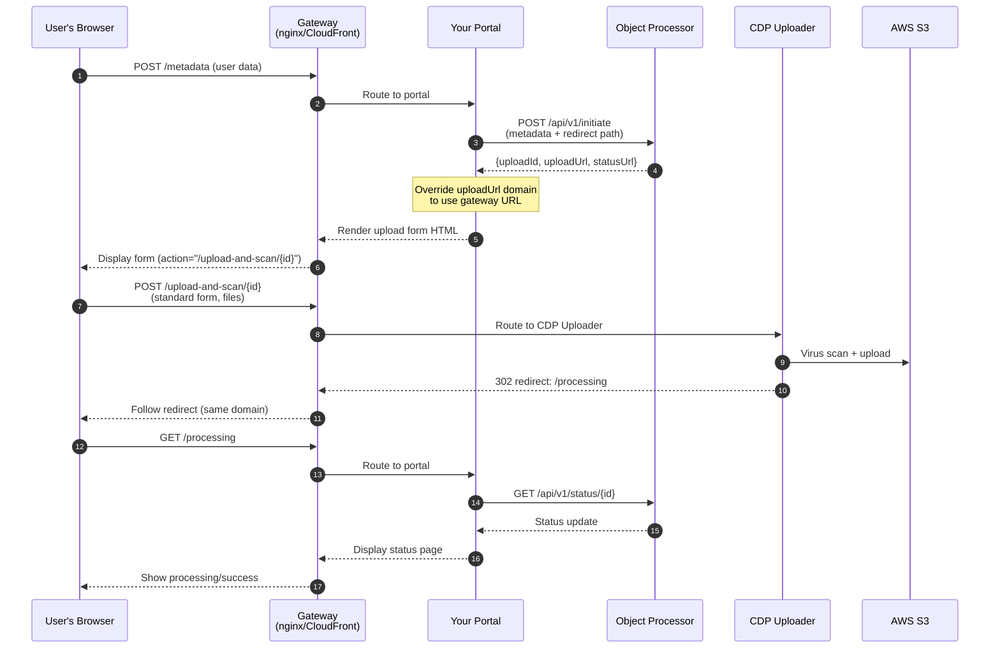
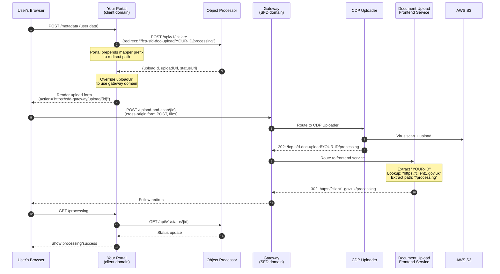
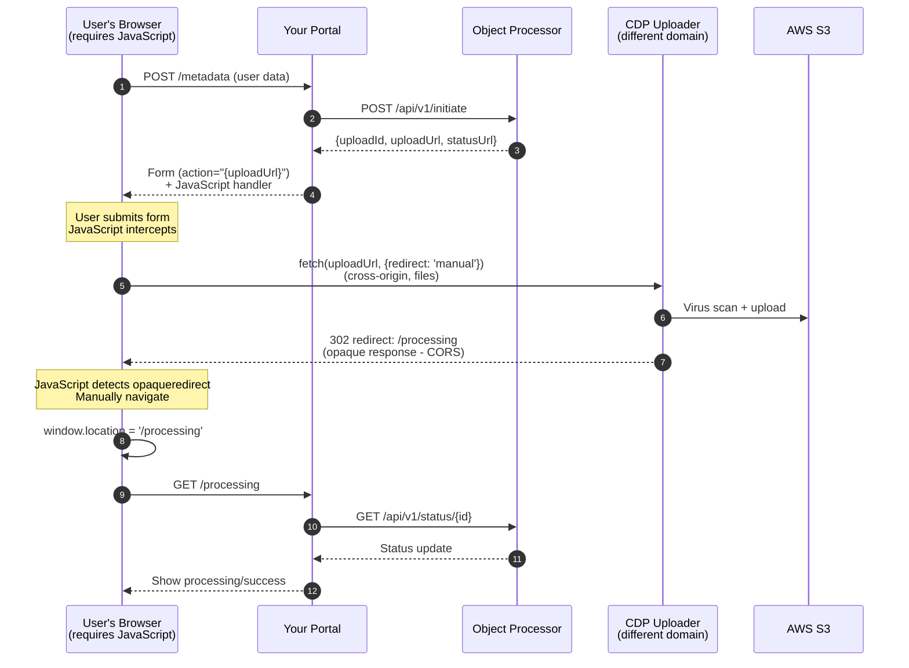

# Single Front Door Document Upload Integration Guide

This repository demonstrates **how client services integrate with the Single Front Door (SFD) Document Upload solution** to enable users to upload documents securely.

## What This Repository Is

This is a **reference implementation and learning resource** that shows three different patterns for integrating with SFD Document Upload. It's a working example of a client portal (like the Rural Payments Portal) that needs to allow users to upload documents through the SFD infrastructure.

**Key Points:**

- ✅ **Working demonstrations** of three integration patterns with pros/cons for each
- ✅ **Technology agnostic** - While this example uses Node.js/Hapi.js, the patterns work with any tech stack
- ✅ **Includes local stubs** - Run everything locally without external dependencies
- ✅ **Production-ready patterns** - Real-world examples that can be adapted for your service

## What You'll Learn

This guide demonstrates:

1. **Three integration patterns** for document upload (gateway routing, frontend redirect, and direct)
2. **When to use each pattern** based on your infrastructure and requirements
3. **Browser-based file upload flows** with sequence diagrams for each pattern
4. **OAuth2 authentication** using AWS Cognito (optional, disabled by default in demos)
5. **Status polling and user feedback** patterns
6. **Local development setup** with included stubs

---

## Table of Contents

- [Understanding the SFD Document Upload Architecture](#understanding-the-sfd-document-upload-architecture)
- [Three Integration Patterns](#three-integration-patterns)
- [Pattern 1: Gateway Routing Mode](#pattern-1-gateway-routing-mode-recommended)
- [Pattern 2: Frontend Redirect Mode](#pattern-2-frontend-redirect-mode)
- [Pattern 3: Direct Mode](#pattern-3-direct-mode-fallback-only)
- [AWS Cognito Authentication](#aws-cognito-authentication)
- [Local Development with Stubs](#local-development-with-stubs)
- [Advanced Configuration](#advanced-configuration)
- [Implementation Details](#implementation-details)
- [Testing](#testing)
- [Related Repositories](#related-repositories)

---

## Understanding the SFD Document Upload Architecture

The SFD Document Upload solution consists of three main components that work together:

### The Components

```
┌─────────────────┐      ┌──────────────────┐     ┌─────────────────┐
│  Your Portal    │─────▶│ Object Processor │────▶│  CDP Uploader   │
│  (this repo)    │      │                  │     │                 │
└─────────────────┘      └──────────────────┘     └─────────────────┘
     │                           │                         │
     │                           │◀───────────────┐        │
     │                           │◀───callback────┘        │
     │                           │                         │
     │                           ▼                         ▼
     │                    ┌──────────────┐         ┌──────────┐
     └─────status check──▶│   MongoDB    │         │   AWS S3 │
        (to Object Proc)  └──────────────┘         └──────────┘
                                 ▲
                                 │
                  (Object Processor queries MongoDB)
```

**1. Your Portal Application (Client Service)**
- **What you build** - The user-facing web application
- **Responsibilities:**
  - Collect business metadata from users (CRN, SBI, FRN, document type, etc.)
  - Obtain OAuth2 tokens from AWS Cognito (optional, when authentication enabled)
  - Call Object Processor APIs to initiate uploads
  - Handle file upload forms (routing varies by integration pattern - see below)
  - Poll for upload status and display results

**2. Object Processor** ([DEFRA/fcp-sfd-object-processor](https://github.com/DEFRA/fcp-sfd-object-processor))
- **Provided by SFD team** - The central API for document uploads
- **Responsibilities:**
  - Validate OAuth2 JWT tokens (when authentication enabled)
  - Provide `/api/v1/initiate` endpoint to create upload sessions
  - Provide `/api/v1/status/{correlationId}` endpoint to query upload status
  - Receive callbacks from CDP Uploader when files are scanned
  - Persist metadata to MongoDB
  - Publish events to AWS SNS for downstream processing

**3. CDP Uploader** ([DEFRA/cdp-uploader](https://github.com/DEFRA/cdp-uploader))
- **Provided by CDP team** - The file upload and scanning service
- **Responsibilities:**
  - Accept file uploads directly from user browsers via multipart form POST
  - Perform virus scanning using ClamAV
  - Upload clean files to AWS S3
  - Send scan results back to Object Processor via callback
  - Redirect browser back to your portal after upload

### How Files Flow

**The key insight:** Files **never pass through your portal backend**. Instead:

```
User's Browser ──┬──▶ CDP Uploader ──▶ S3
                 │    (via gateway or direct)
                 │
                 └──▶ Your Portal Backend
                      (only metadata and status polling)
```

This architecture keeps large files out of your application, reducing backend load and simplifying infrastructure.

---

## Three Integration Patterns

The SFD Document Upload solution supports **three different patterns** for integrating browser file uploads. Choose the pattern that best fits your infrastructure:

| Pattern | Best For | JavaScript Required | Works Without JS |
|---------|----------|---------------------|------------------|
| **[Gateway Routing](#pattern-1-gateway-routing-mode-recommended)** | Clients that can set proxy pass on host domain such as CDP platform services | ❌ No | ✅ Yes |
| **[Frontend Redirect](#pattern-2-frontend-redirect-mode)** | Clients that cannot set proxy pass on host domain (Not yet supported in Production) | ❌ No | ✅ Yes |
| **[Direct](#pattern-3-direct-mode-fallback-only)** | Fallback (last resort only) | ✅ Yes | ❌ No |

**Quick Decision Guide:**

- **Are you building a CDP platform service?** → Use **Gateway Routing**
- **Do you have control over gateway infrastructure (nginx, CloudFront, API Gateway)?** → Use **Gateway Routing**
- **Are you an external service on a different domain without gateway control?** → Use **Frontend Redirect**
- **Can you absolutely not use gateway infrastructure?** → Use **Direct** (but note the accessibility trade-offs)

All three patterns are demonstrated in this repository with working examples you can run locally.

---

## Pattern 1: Gateway Routing Mode (Recommended)

**Best for:** CDP platform services, services with infrastructure gateway capabilities (nginx, CloudFront, API Gateway)

### What is Gateway Routing?

Gateway routing uses a **reverse proxy** as a single entry point for all browser requests. The browser only ever communicates with one domain (the gateway), and the gateway intelligently routes requests to different backend services based on URL paths.

This is the standard architecture pattern used by most production web applications.

### How It Works - Sequence Diagram



### Pros and Cons

**Pros:**
- ✅ **Accessible** - Works perfectly without JavaScript
- ✅ **Simple CSP** - Only `'self'` needed (everything is same-origin to the browser)
- ✅ **Clean user experience** - Single domain throughout entire journey
- ✅ **Standard web architecture** - How modern applications are built

**Cons:**
- ⚠️ Requires gateway infrastructure (nginx, CloudFront, etc.)
- ⚠️ Gateway must be configured to route `/upload-and-scan/*` to CDP Uploader

### Running the Demo

```bash
# Start all services (portal, stub APIs, and nginx gateway)
docker compose up

# Open your browser
🌐 http://localhost:3019
```

**Localhost Ports Explained:**

| Port | Service | Purpose | Accessed By |
|------|---------|---------|-------------|
| **3019** | NGINX Gateway | Reverse proxy - **YOUR ENTRY POINT** | Users (in gateway-routing mode) |
| 3020 | Portal Application | Your web app backend | Gateway (proxied) |
| 3021 | Document Upload Stub | Mock Object Processor + CDP Uploader | Portal + Gateway |

**What happens when you run this:**

1. Docker Compose starts 4 containers: portal, stub APIs, frontend stub, and NGINX gateway
2. NGINX is configured to:
   - Route ALL requests from `localhost:3019` based on path
   - Route `/upload-and-scan/*` → Document Upload Stub (3021)
   - Route everything else → Portal Application (3020)
3. Users only see `localhost:3019` - everything appears same-origin

### Try It Yourself

1. Visit [http://localhost:3019/document-upload/sign-in](http://localhost:3019/document-upload/sign-in)
2. Enter CRN: `1234567890`
3. Click "Continue"
4. Fill in metadata:
   - SBI: `123456789`
   - FRN: `1234567890`
   - Reference: `My Test Upload`
   - Type: Select "CS Agreement Evidence"
   - Service: Select "FCP SFD Frontend"
5. Click "Continue"
6. Upload a file using the standard HTML form (no JavaScript needed!)
7. Watch it process and succeed

**Note:** In this demo, the stub automatically marks all uploads as successful after 2 seconds.

### Configuration Files

**Environment variables:**
```bash
UPLOAD_MODE=gateway-routing
GATEWAY_URL=http://localhost:3019
REDIRECT_AFTER_UPLOAD=/document-upload/processing
```

**Key implementation files:**
- [nginx/nginx.conf](nginx/nginx.conf) - Gateway routing rules
- [src/routes/document-upload.js](src/routes/document-upload.js) - uploadUrl override logic
- [compose.yml](compose.yml) - Docker service definitions

---

## Pattern 2: Frontend Redirect Mode

**Best for:** External services on different domains, multi-client scenarios, services without gateway control

> **Note**: Single Front Door have not developed infrastructure to support this until there is evidence a client needs this level of complexity.

### What is Frontend Redirect Mode?

Frontend redirect mode solves a specific challenge:
- Your portal runs on `client1.gov.uk`
- CDP Uploader runs on a different domain and returns **relative** redirects
- After upload, the browser needs to return to `client1.gov.uk/processing`
- A central "redirect mapper" service translates relative redirects into absolute URLs for each client

This pattern is useful when:
- Multiple client portals exist on different domains
- Clients don't control gateway infrastructure (e.g., external portals in Crown Hosting)
- You want centralized redirect mapping logic maintained by the SFD team

### How It Works - Sequence Diagram



### Pros and Cons

**Pros:**
- ✅ **Accessible** - Works without JavaScript
- ✅ **Multi-client support** - One redirect mapper service supports many clients
- ✅ **No gateway required on your side** - You don't need to configure routing infrastructure
- ✅ **Centralized mapping** - SFD team manages the redirect logic

**Cons:**
- ⚠️ Requires SFD team to develop and maintain Document Upload Frontend service
- ⚠️ Your client identifier must be registered in the mapping service
- ⚠️ CSP must allow cross-origin form POST to gateway domain

### Running the Demo

```bash
# Start with frontend-redirect mode
UPLOAD_MODE=frontend-redirect docker compose up

# Open your browser
🌐 http://localhost:3020
```

**Localhost Ports Explained:**

| Port | Service | Purpose | Accessed By |
|------|---------|---------|-------------|
| **3020** | Portal Application | Your web app - **YOUR ENTRY POINT** | Users (in frontend-redirect mode) |
| 3019 | NGINX Gateway | Handles uploads and redirect mapping | Browser (for file uploads) |
| 3021 | Document Upload Stub | Mock Object Processor + CDP Uploader | Portal + Gateway |
| 3022 | Frontend Stub | Mock redirect mapper service | Gateway (for redirects) |

**What happens when you run this:**

1. Docker Compose starts 4 containers
2. Users access your portal directly at `localhost:3020`
3. When uploading, the HTML form points to `localhost:3019` (cross-origin)
4. After upload, the redirect chain is:
   - CDP Uploader → Gateway → Frontend Stub → Your Portal
5. Frontend Stub maps `portal-stub` identifier → `http://localhost:3020`

### Try It Yourself

1. Visit [http://localhost:3020/document-upload/sign-in](http://localhost:3020/document-upload/sign-in)
2. Enter CRN: `1234567890`
3. Fill in metadata
4. Upload a file - notice the form action points to `localhost:3019` (cross-origin)
5. After upload, observe the redirect chain bringing you back to `localhost:3020/processing`
6. Watch it process and succeed

**Open your browser's Network tab** to see the redirect chain in action!

### Configuration Files

**Environment variables:**
```bash
UPLOAD_MODE=frontend-redirect
GATEWAY_URL=http://localhost:3019
REDIRECT_AFTER_UPLOAD=/document-upload/processing
ADDITIONAL_UPLOAD_DOMAINS=http://localhost:3019  # Allow cross-origin form POST
```

**Key implementation files:**
- [document-upload-frontend-stub/src/routes/redirect.js](document-upload-frontend-stub/src/routes/redirect.js) - Client identifier mapping
- [nginx/nginx.conf](nginx/nginx.conf) - Gateway routing (proxies `/fcp-sfd-doc-upload/` to frontend stub)
- [src/routes/document-upload.js](src/routes/document-upload.js) - Redirect prefix logic
- [src/plugins/content-security-policy.js](src/plugins/content-security-policy.js) - CSP configuration

---

## Pattern 3: Direct Mode (Fallback Only)

**Best for:** Situations where neither gateway routing nor frontend redirect are feasible (use only as last resort)

⚠️ **Warning:** This mode requires JavaScript and fails accessibility requirements.

### What is Direct Mode?

Direct mode has browsers upload files directly to the CDP Uploader domain without any gateway or redirect mapping infrastructure. Because this is a cross-origin request with redirect responses, JavaScript is required to detect the opaque redirect and manually navigate back to your portal.

**Use this only when:**
- You have no gateway infrastructure available
- Frontend redirect mode cannot be configured
- You accept the accessibility and progressive enhancement trade-offs

### How It Works - Sequence Diagram



### Pros and Cons

**Pros:**
- ✅ **Simpler infrastructure** - No gateway or frontend redirect service needed
- ✅ **May be only option** in very constrained environments

**Cons:**
- ❌ **Requires JavaScript** - Users without JS cannot upload files
- ❌ **Not accessible** - Fails WCAG/GOV.UK accessibility requirements
- ❌ **Not Service Manual compliant** - Does not meet progressive enhancement standard
- ❌ **Cross-origin complexity** - Requires careful CSP configuration
- ❌ **Reduced browser compatibility** - Depends on fetch API and redirect: 'manual'
- ❌ **Poor user experience** - Users with JS disabled see a broken flow

### Running the Demo

```bash
# Start with direct mode
UPLOAD_MODE=direct docker compose up

# Open your browser
🌐 http://localhost:3020
```

**Localhost Ports Explained:**

| Port | Service | Purpose | Accessed By |
|------|---------|---------|-------------|
| **3020** | Portal Application | Your web app - **YOUR ENTRY POINT** | Users (in direct mode) |
| 3021 | Document Upload Stub | Mock Object Processor + CDP Uploader | Portal + Browser (direct) |
| 3019 | Gateway | Not used in direct mode | N/A |
| 3022 | Frontend Stub | Not used in direct mode | N/A |

**What happens when you run this:**

1. Docker Compose starts all containers
2. Users access your portal directly at `localhost:3020`
3. When uploading, JavaScript `fetch()` sends files directly to `localhost:3021`
4. JavaScript must detect the opaque redirect and manually navigate

### Try It Yourself

1. Visit [http://localhost:3020/document-upload/sign-in](http://localhost:3020/document-upload/sign-in)
2. Enter CRN: `1234567890`
3. Fill in metadata
4. Upload a file - JavaScript will intercept the form submission
5. **Open your browser's Console tab** to see the fetch() call and redirect detection
6. **Try disabling JavaScript** - observe that the upload fails completely

### Configuration Files

**Environment variables:**
```bash
UPLOAD_MODE=direct
ADDITIONAL_UPLOAD_DOMAINS=http://localhost:3021  # Allow direct uploader access
```

**Key implementation files:**
- [src/client/javascript/document-upload.js](src/client/javascript/document-upload.js) - JavaScript fetch() interception

---

## AWS Cognito Authentication

All three patterns support optional OAuth2 authentication using **AWS Cognito** via the CDP API Gateway.

### When is Cognito Used?

- **Your portal** obtains OAuth2 access tokens from Cognito using client credentials flow
- **Object Processor** validates tokens via Microsoft Entra ID
- This ensures only authorized services can initiate uploads

### Disabled by Default in All Demos

For easier local development, **Cognito is disabled by default** in all three demo modes.

```bash
# In .env (default for local development)
COGNITO_ENABLED=false
```

When disabled:
- No OAuth2 tokens are sent to Object Processor
- Object Processor must also have authentication disabled (`AUTH_ENABLED=false`)
- Document upload stub works without authentication

### Enabling Cognito

To enable authentication:

1. Copy the example environment file:
   ```bash
   cp .env.example .env
   ```

2. Edit `.env` and set:
   ```bash
   COGNITO_ENABLED=true
   COGNITO_DOMAIN=your-service-c63f2.auth.eu-west-2.amazoncognito.com
   COGNITO_CLIENT_ID=your-app-client-id-here
   COGNITO_CLIENT_SECRET=your-app-client-secret-here
   ```

3. Restart the services:
   ```bash
   docker compose restart
   ```

**When to enable:**
- Testing with real Object Processor (production/staging environments)
- Integration testing with full authentication flow
- Production deployments

### How Cognito Authentication Works

When `COGNITO_ENABLED=true`:

1. **Portal requests token** from Cognito using client credentials grant:
   ```
   POST https://{COGNITO_DOMAIN}/oauth2/token
   Authorization: Basic {base64(clientId:clientSecret)}
   Content-Type: application/x-www-form-urlencoded
   
   grant_type=client_credentials&scope=api/write
   ```

2. **Cognito returns JWT** access token

3. **Portal calls Object Processor** with token:
   ```
   POST /api/v1/initiate
   Authorization: Bearer {token}
   Content-Type: application/json
   
   {...metadata...}
   ```

4. **Object Processor validates token** with Microsoft Entra ID

5. **If valid**, Object Processor processes the request

**Token caching:** The portal caches tokens and only requests new ones when they expire, reducing calls to Cognito.

**Implementation:** See [src/common/helpers/cognito.js](src/common/helpers/cognito.js) for details.

---

## Local Development with Stubs

This repository includes two stub services that eliminate external dependencies for local development.

### 1. Document Upload Stub

**Location:** [document-upload-stub/](document-upload-stub/)

**Simulates:** Object Processor + CDP Uploader (both in one service)

**What it stubs:**

| Component | Endpoints | Description |
|-----------|-----------|-------------|
| **Object Processor** | `POST /api/v1/initiate` | Creates upload sessions, returns `{uploadId, uploadUrl, statusUrl, correlationId}` |
| | `GET /api/v1/status/{correlationId}` | Returns upload status (`IN_PROGRESS` → `SUCCESSFUL`) |
| **CDP Uploader** | `POST /upload-and-scan/{uploadId}` | Accepts file uploads via multipart form POST |
| | | Returns `302` redirect to processing page |

**Features:**
- ✅ In-memory storage (no database required)
- ✅ Returns relative redirects (like real CDP Uploader)
- ✅ Automatically marks uploads as `SUCCESSFUL` after 2 seconds
- ✅ No authentication required
- ✅ Runs on port 3021
- ✅ CORS enabled for browser access

**Usage:** This stub is **used by default** in `docker compose up`. You don't need to configure anything.

**To use real Object Processor instead:**
```bash
# In .env file
OBJECT_PROCESSOR_HOST=http://real-object-processor:3004
COGNITO_ENABLED=true  # Required for real Object Processor
```

**See:** [document-upload-stub/README.md](document-upload-stub/README.md) for implementation details.

### 2. Document Upload Frontend Stub

**Location:** [document-upload-frontend-stub/](document-upload-frontend-stub/)

**Simulates:** Document Upload Frontend redirect mapper service

**What it stubs:**

The production Document Upload Frontend service that maps client identifiers to absolute redirect URLs.

**How it works:**

1. Receives request: `GET /fcp-sfd-doc-upload/{clientIdentifier}/some/path`
2. Extracts `clientIdentifier` (e.g., `portal-stub`)
3. Looks up mapping:
   ```javascript
   const CLIENT_MAPPINGS = {
     'portal-stub': 'http://localhost:3020',
     'another-client': 'https://another-client.gov.uk'
   }
   ```
4. Returns redirect: `302 Location: {clientUrl}/some/path`

**Configuration:**

The stub is pre-configured with:
```javascript
{
  'portal-stub': 'http://localhost:3020'
}
```

**Usage:**
- Only used in **frontend-redirect mode**
- Automatically started with `docker compose up`
- Runs on port 3022
- Accessed via gateway at `/fcp-sfd-doc-upload/*`

**See:** [document-upload-frontend-stub/README.md](document-upload-frontend-stub/README.md) for details.

### 3. NGINX Gateway

**Location:** [nginx/nginx.conf](nginx/nginx.conf)

**Provides:** Reverse proxy for gateway routing and frontend redirect modes

**What it does:**

```nginx
# Route file uploads to uploader stub
location /upload-and-scan/ {
    proxy_pass http://document-upload-stub:3021;
}

# Route redirect mapping to frontend stub
location /fcp-sfd-doc-upload/ {
    proxy_pass http://document-upload-frontend-stub:3022;
}

# Route everything else to portal
location / {
    proxy_pass http://fcp-sfd-portal-stub:3020;
}
```

**Usage:**
- Runs on port 3019
- Acts as single entry point in gateway-routing mode
- Handles upload routing in all modes (local dev)

---

## Advanced Configuration

### Environment Variables Reference

All configuration is managed through environment variables. Copy [.env.example](.env.example) to `.env` and customize:

```bash
cp .env.example .env
# Edit with your editor of choice
```

#### Core Settings

| Variable | Default | Description | Impact |
|----------|---------|-------------|--------|
| `UPLOAD_MODE` | `gateway-routing` | Integration pattern to use | Determines how browser uploads are routed and whether JavaScript is required.<br/><br/>**Options:**<br/>• `gateway-routing` - Users access via gateway, uploads via gateway (no JS)<br/>• `frontend-redirect` - Users access portal directly, uploads via gateway (no JS)<br/>• `direct` - Users access portal directly, uploads direct to uploader (requires JS) |
| `OBJECT_PROCESSOR_HOST` | `http://document-upload-stub:3021` | Object Processor API URL | Points to the service that provides `/api/v1/initiate` and `/api/v1/status` endpoints.<br/><br/>**Change to:** Real Object Processor URL for integration testing (e.g., `http://real-processor:3004`) |
| `GATEWAY_URL` | `http://localhost:3019` | Gateway domain for uploads | Used in gateway-routing and frontend-redirect modes to override upload URLs.<br/><br/>**Should be:** Your infrastructure gateway domain (nginx, CloudFront, etc.) |
| `REDIRECT_AFTER_UPLOAD` | `/document-upload/processing` | Path to redirect after upload | Where CDP Uploader redirects the browser after accepting files.<br/><br/>**Note:** In frontend-redirect mode, automatically prefixed with `/fcp-sfd-doc-upload/{client-id}` |

#### Authentication Settings

| Variable | Default | Description | Impact |
|----------|---------|-------------|--------|
| `COGNITO_ENABLED` | `false` | Enable AWS Cognito authentication | When `true`, portal obtains OAuth2 tokens and includes them in Object Processor API calls.<br/><br/>**Requires:** `COGNITO_DOMAIN`, `COGNITO_CLIENT_ID`, `COGNITO_CLIENT_SECRET` to be set |
| `COGNITO_DOMAIN` | (empty) | Cognito domain | AWS Cognito OAuth2 domain.<br/><br/>**Example:** `your-service-c63f2.auth.eu-west-2.amazoncognito.com`<br/>**Required when:** `COGNITO_ENABLED=true` |
| `COGNITO_CLIENT_ID` | (empty) | Cognito client ID | OAuth2 client ID from Cognito User Pool.<br/><br/>**Required when:** `COGNITO_ENABLED=true` |
| `COGNITO_CLIENT_SECRET` | (empty) | Cognito client secret | OAuth2 client secret.<br/><br/>**Required when:** `COGNITO_ENABLED=true`<br/>⚠️ **Keep this secure!** Never commit to version control |

#### Security Settings

| Variable | Default | Description | Impact |
|----------|---------|-------------|--------|
| `ADDITIONAL_UPLOAD_DOMAINS` | `http://localhost:3019,http://localhost:3021` | Comma-separated list of allowed upload domains | Configures Content Security Policy (CSP) `form-action` and `connect-src` directives.<br/><br/>**Requirements by mode:**<br/>• `gateway-routing`: None needed (same-origin)<br/>• `frontend-redirect`: Must include gateway domain<br/>• `direct`: Must include uploader domain<br/><br/>**Example:** `http://localhost:3019,https://cdp-uploader.example.com` |
| `SESSION_COOKIE_PASSWORD` | Auto-generated | Cookie encryption key | Used to encrypt session cookies.<br/><br/>**Must be:** At least 32 characters<br/>**Auto-generated** if not provided<br/>⚠️ **Keep secure!** Never commit to version control |

### Switching Modes at Runtime

You can switch between modes without rebuilding containers:

```bash
# Stop current containers
docker compose down

# Start with different mode using environment variable
UPLOAD_MODE=frontend-redirect docker compose up

# OR edit .env file and restart
echo "UPLOAD_MODE=direct" >> .env
docker compose up
```

**What changes between modes:**

| Aspect | gateway-routing | frontend-redirect | direct |
|--------|----------------|-------------------|--------|
| User entry point | Gateway (3019) | Portal (3020) | Portal (3020) |
| Upload destination | Gateway → Uploader | Gateway → Uploader | Direct to Uploader |
| JavaScript required | ❌ No | ❌ No | ✅ Yes |
| CSP configuration | Simple (`'self'`) | Gateway in `form-action` | Uploader in `form-action` + `connect-src` |
| Redirect handling | Relative in gateway | Mapped by frontend stub | JavaScript intercept |

### Using Real vs Stub Services

#### Local Development (Default)
```bash
# Uses all stubs (no external dependencies)
docker compose up
```

All services run locally:
- Document Upload Stub (3021) = Object Processor + CDP Uploader
- Frontend Stub (3022) = Redirect mapper
- NGINX (3019) = Gateway

#### Integration Testing with Real Object Processor
```bash
# Point to real Object Processor
OBJECT_PROCESSOR_HOST=http://real-object-processor:3004 \
COGNITO_ENABLED=true \
COGNITO_DOMAIN=your-domain.auth.eu-west-2.amazoncognito.com \
COGNITO_CLIENT_ID=your-client-id \
COGNITO_CLIENT_SECRET=your-secret \
docker compose up
```

What happens:
- Portal calls real Object Processor (with Cognito tokens)
- Real Object Processor provides real CDP Uploader URLs
- Files upload to real CDP Uploader and S3
- Real virus scanning with ClamAV

### Content Security Policy (CSP) Configuration

The portal **automatically configures CSP** based on `UPLOAD_MODE`:

#### Gateway Routing Mode
```
Content-Security-Policy: 
  form-action 'self';
  connect-src 'self';
```

- ✅ Forms only submit to same origin
- ✅ JavaScript only connects to same origin
- ✅ No additional domains needed

#### Frontend Redirect Mode
```
Content-Security-Policy: 
  form-action 'self' http://localhost:3019;
  connect-src 'self';
```

- ✅ Forms can submit to gateway domain (cross-origin POST)
- ✅ JavaScript only connects to same origin
- ⚠️ Must set `ADDITIONAL_UPLOAD_DOMAINS` to include gateway

#### Direct Mode
```
Content-Security-Policy: 
  form-action 'self' http://localhost:3021;
  connect-src 'self' http://localhost:3021;
```

- ✅ Forms can submit to any domain
- ✅ JavaScript can `fetch()` to uploader domain
- ⚠️ Must set `ADDITIONAL_UPLOAD_DOMAINS` to include uploader domain

**Implementation:** [src/plugins/content-security-policy.js](src/plugins/content-security-policy.js)

### Port Reference

| Port | Service | Purpose | User Access |
|------|---------|---------|-------------|
| **3019** | NGINX Gateway | Reverse proxy routes `/upload-and-scan/` to uploader, `/fcp-sfd-doc-upload/` to frontend stub, everything else to portal | ✅ Yes (gateway-routing mode entry point) |
| **3020** | Portal Application | Your web application | ✅ Yes (frontend-redirect/direct mode entry point) |
| 3021 | Document Upload Stub | Mock Object Processor + CDP Uploader APIs | ❌ No (backend service) |
| 3022 | Frontend Stub | Mock redirect mapper | ❌ No (backend service) |

---

## Implementation Details

This section provides technical details about the portal implementation for developers.

### Tech Stack

- **Node.js 24.12.0+** - LTS version with native ESM support
- **Hapi.js 21** - Server framework with plugin architecture
- **Nunjucks** - Templating engine with GOV.UK Frontend components
- **Webpack** - Bundles client-side JS/SCSS from `src/client/`
- **Vitest** - Testing framework with `vi` mocking utilities
- **Neostandard** - ESLint config (ECMAScript 2025)
- **Convict** - Schema-based configuration management
- **Pino** - Structured logging in ECS format

### Project Structure

```
src/
├── routes/                    # Hapi route handlers
│   ├── document-upload.js    # 6-step upload flow handlers
│   ├── index.js              # Home page
│   └── health.js             # Health check endpoint
├── plugins/                   # Hapi plugins
│   ├── router.js             # Auto-registers routes
│   ├── session.js            # Yar session management
│   ├── headers.js            # Security headers
│   └── content-security-policy.js  # CSP configuration
├── common/helpers/
│   ├── cognito.js            # OAuth2 token manager
│   ├── object-processor.js   # API client
│   └── logging/              # Pino logger setup
├── config/
│   ├── config.js             # Convict schema
│   └── nunjucks/             # Template configuration
├── views/                     # Nunjucks templates
│   ├── document-upload/      # Upload flow pages
│   └── layouts.njk           # Base layout
└── client/                    # Frontend assets
    ├── javascript/
    │   ├── application.js    # Main entry point
    │   └── document-upload.js  # Direct mode upload handler
    └── stylesheets/          # SASS/SCSS styles

document-upload-stub/         # Local development stub
document-upload-frontend-stub/  # Redirect mapper stub
nginx/                        # Gateway configuration
```

### Key Files by Pattern

**Gateway Routing:**
- [nginx/nginx.conf](nginx/nginx.conf) - Gateway routing rules
- [src/routes/document-upload.js](src/routes/document-upload.js#L51-L67) - Upload URL override

**Frontend Redirect:**
- [document-upload-frontend-stub/src/routes/redirect.js](document-upload-frontend-stub/src/routes/redirect.js) - Client mapping
- [src/routes/document-upload.js](src/routes/document-upload.js#L73-L78) - Redirect prefix

**Direct Mode:**
- [src/client/javascript/document-upload.js](src/client/javascript/document-upload.js) - JavaScript fetch handler

**All Patterns:**
- [src/common/helpers/object-processor.js](src/common/helpers/object-processor.js) - API client
- [src/common/helpers/cognito.js](src/common/helpers/cognito.js) - OAuth2 authentication
- [src/plugins/content-security-policy.js](src/plugins/content-security-policy.js) - CSP config

### User Journey

The portal implements a 6-step user journey following GOV.UK Design System patterns:

1. **Sign In** (`/document-upload/sign-in`)
   - User enters 10-digit CRN
   - Stored in session cookie

2. **Enter Metadata** (`/document-upload/metadata`)
   - SBI (9 digits)
   - FRN (10 digits)
   - Reference (user's own text)
   - Document Type (dropdown)
   - Service (dropdown)

3. **Upload Files** (`/document-upload/upload`)
   - Portal calls `POST /api/v1/initiate`
   - Receives upload URL and status URL
   - Renders form pointing to upload URL
   - User selects files and submits

4. **Processing** (`/document-upload/processing`)
   - Auto-polls `GET /api/v1/status/{correlationId}` every 3 seconds
   - Shows `IN_PROGRESS` → `SUCCESSFUL`/`REJECTED`
   - CDP Uploader performs virus scan in background

5. **Success** (`/document-upload/success`)
   - Displays confirmation
   - Shows submission ID and uploaded files

6. **Error** (`/document-upload/error`)
   - Shows rejection reason
   - Lists affected files

---

## Testing

### Unit Tests

Run tests with Vitest:

```bash
# Run all tests with coverage (in Docker)
npm run docker:test

# Watch mode for TDD
npm run docker:test:watch

# Run tests locally (requires Node 24.12.0+)
npm test

# Generate coverage report
npm run test:coverage
```

Tests are located in `test/unit/` mirroring the `src/` structure.

### Linting

```bash
# Check for issues
npm run lint

# Auto-fix issues
npm run lint:fix
```

Uses Neostandard (ESLint) with ECMAScript 2025 syntax support.

### Manual Testing

Follow the "Try It Yourself" sections for each pattern above.

### Testing with Different Modes

```bash
# Test gateway-routing mode
docker compose up
# Visit http://localhost:3019
# Disable JavaScript in browser - upload should still work

# Test frontend-redirect mode
UPLOAD_MODE=frontend-redirect docker compose up
# Visit http://localhost:3020
# Open Network tab to see redirect chain
# Disable JavaScript - upload should still work

# Test direct mode
UPLOAD_MODE=direct docker compose up
# Visit http://localhost:3020
# Open Console tab to see fetch() calls
# Disable JavaScript - upload should fail gracefully
```

---

## Related Repositories

**SFD Document Upload Service:**
- **[DEFRA/fcp-sfd-object-processor](https://github.com/DEFRA/fcp-sfd-object-processor)** - Object Processor API (backend service)

**CDP Infrastructure:**
- **[DEFRA/cdp-uploader](https://github.com/DEFRA/cdp-uploader)** - CDP Uploader service (file upload and virus scanning)

**Local Stubs (in this repo):**
- **[document-upload-stub/](document-upload-stub/)** - Simulates Object Processor + CDP Uploader
- **[document-upload-frontend-stub/](document-upload-frontend-stub/)** - Simulates Document Upload Frontend

---

## Licence

THIS INFORMATION IS LICENSED UNDER THE CONDITIONS OF THE OPEN GOVERNMENT LICENCE found at:

<http://www.nationalarchives.gov.uk/doc/open-government-licence/version/3>

The following attribution statement MUST be cited in your products and applications when using this information.

> Contains public sector information licensed under the Open Government license v3

### About the licence

The Open Government Licence (OGL) was developed by the Controller of Her Majesty's Stationery Office (HMSO) to enable
information providers in the public sector to license the use and re-use of their information under a common open
licence.

It is designed to encourage use and re-use of information freely and flexibly, with only a few conditions.
